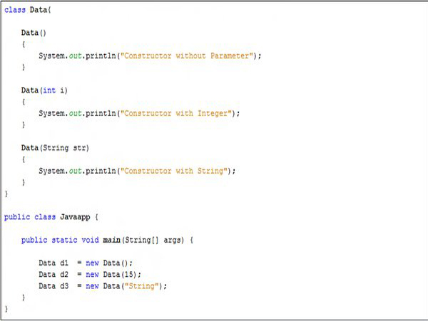

<!-- Improved compatibility of back to top link: See: https://github.com/othneildrew/Best-README-Template/pull/73 -->
<a name="readme-top"></a>

<!-- PROJECT LOGO -->
<br />
<br />
<div align="center">
  <a href="https://github.com/dhondoi/Java-Library-Cerita-Constructor-Overloading">
    
  </a>

  <h3 align="center">The Constructor Overloading</h3>

  <p align="center">
     Menjelaskan konsep constructor overloading pada bahasa pemrograman Java menggunakan cerita dengan harapan memudahkan para pembaca khususnya para programmer menyerap dengan mudah konsep ini.
  </p>
</div>

<!-- TABLE OF CONTENTS -->
<details style="margin-top: 24px;">
  <summary>Table of Contents</summary>
      <ul>
          <li><a href="#the-story">The Story</a></li>
          
      </ul>
</details>

<!-- THE STORY -->
## The Story

Kisah ini menceritakan seorang junior programmer yang bekerja pada suatu perusahaan divisi programmer. Pada suatu hari kerja, divisi tersebut sedang meeting untuk membuat fitur baru pada sebuah aplikasi client. selesai meeting, para senior meminta junior untuk membuat sebuah class "Gelas" dan mulailah junior tersebut mengerjakan tugasnya.

GelasV1.java
```java
// membuat objek gelas
public class Gelas {

    // attribute
    private int diameterAtas = 8; // diameter atas default 8 cm
    private int diameterBawah = 8; // diameter bawah default 8 cm
    private int tinggi = 10; // diameter tinggi default 10 cm
    private String bahan = "kaca"; // bahan default kaca

    /**
     * a lot of behavior but no setter attribute
     */
}
```

Kode tersebut diproses menjadi library lalu disebarkan kepada para senior. Setelah mencoba library tersebut, senior 1 berkata "Oh ini udah ok, udah bisa jalan." dan pergi untuk mengerjakan proses lainnya dengan menggunakan library tersebut. Senior 2 berkata "udah OK, namun bisa tambahin kode biar bisa masukkin data secara kustom?" dan junior "meng-iya-kan" lalu senior 2 pergi untuk mengerjakan proses lainnya. Singkat cerita, diproses permintaan senior 2.

GelasV2.java
```java
// membuat objek gelas
public class Gelas {

    // attribute
    private int diameterAtas = 8; // diameter atas default 8 cm
    private int diameterBawah = 8; // diameter bawah default 8 cm
    private int tinggi = 10; // diameter tinggi default 10 cm
    private String bahan = "kaca"; // bahan default kaca

    // constructor
    public Gelas(int diameterAtas, int diameterBawah, int tinggi, String bahan) {
        this.diameterAtas = diameterAtas;
        this.diameterBawah = diameterBawah;
        this.tinggi = tinggi;
        this.bahan = bahan;
    }

    /**
     * a lot of behavior but no setter attribute
     */
}
```

Junior tersebut memberitahukan kepada semua senior bahwa ada update library Gelas yang wajib dipakai (anggaplah ada data penting yang diperlukan). Disinilah mulai terjadi permasalahan yang dimana senior 1 mengalami error pada kodenya karena update library gelas dan dia berkata "Hey, kode saya jadi rusak. Tolong benarkan kodemu." dan pergi sambil ngedumel. Senior 2 datang dan berkata "wah bisa kustom, tapi tolong tambahin data warna gelas ya." lalu pergi. junior itu pun mulai mengerjakan tugasnya kembali.

GelasV3.java
```java
// membuat objek gelas
public class Gelas {

    // attribute
    private int diameterAtas;
    private int diameterBawah;
    private int tinggi;
    private String bahan;
    private String warna;

    // constructor
    public Gelas(int diameterAtas, int diameterBawah, int tinggi, String bahan, String warna) {
        this.diameterAtas = diameterAtas;
        this.diameterBawah = diameterBawah;
        this.tinggi = tinggi;
        this.bahan = bahan;
        this.warna = warna;
    }

    // constructor overloading
    public Gelas(int diameterAtas, int diameterBawah, int tinggi, String bahan) {
        this(diameterAtas, diameterBawah, tinggi, bahan, "merah"); // warna default merah
    }

    // constructor overloading
    public Gelas(int diameterAtas, int diameterBawah, int tinggi) {
        this(diameterAtas, diameterBawah, tinggi, "kaca"); // bahan default kaca
    }

    // constructor overloading
    public Gelas(int diameterAtas, int diameterBawah) {
        this(diameterAtas, diameterBawah, 10); // diameter tinggi default 10 cm
    }

    // constructor overloading
    public Gelas(int diameterAtas) {
        this(diameterAtas, 8); // diameter bawah default 8 cm
    }

    public Gelas() {
        this(8); // diameter atas default 8 cm
    }

    /**
     * a lot of behavior but no setter attribute
     */
}
```

Junior tersebut menyebarkan kepada senior update library tersebut. Senior 1 tidak mendapatkan error dan senior 2 laparnya terpenuhi. dan mereka-pun bahagia.

<p align="right">(<a href="#readme-top">back to top</a>)</p>

![MonoAlphabet][monoalphabet]


<!-- LINK BADGE & IMAGE-->
<!-- https://github.com/Ileriayo/markdown-badges -->

[monoalphabet]: images/monoalphabet.png
